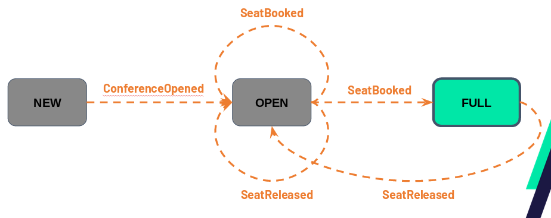
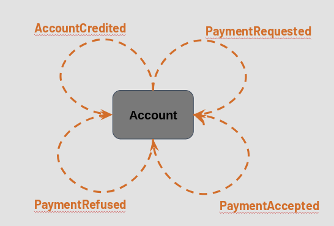
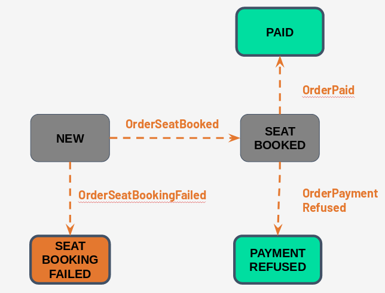
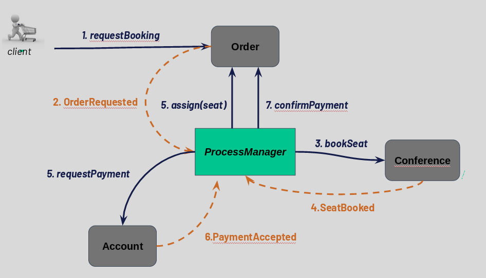
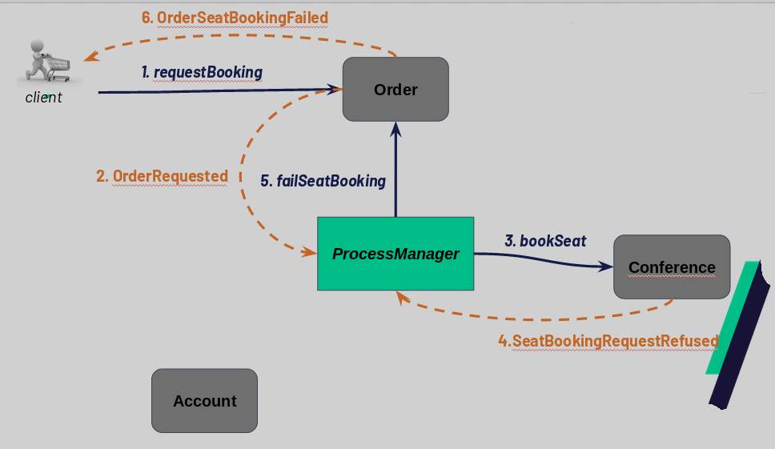
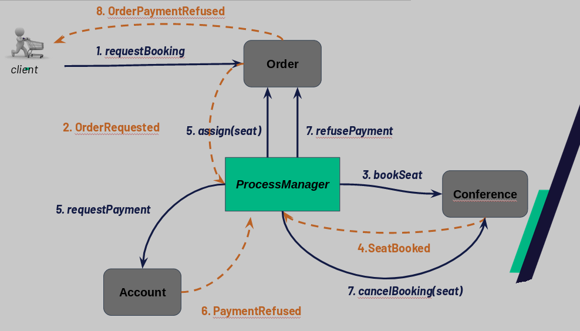

Event-sourcing : conference booking
===================================

*Goal: implement an event sourced complex business process (conference booking system)*

## Understand the business

The business we are to implement is a conference booking system. 
When the customer orders a seat booking for a conference, he should pay the conference price and receive a seat booking number.

Check out the following scenario:

_**Scenario:** successfully book a seat for a conference_
```gherkin
Given I am a customer
And I credit my account with 50E
And "Why testing is not an option" is a 50 seats conference costing 10E 
When I book a seat for the conference "Why testing is not an option"
Then my account is debited of 10E
And I get a seat booked
And available seats for conference drop down to 49
```
_**Scenario:** booking attempt failure for a fully booked conference_
```gherkin
Given I am a customer
And "Why testing is not an option" is a 50 seats conference with 50 seats already booked
When I try to book a seat for the conference "Why testing is not an option"
Then I get no seat
And my account is not debited
```
_**Scenario:** booking attempt failure for a conference when the price is too high_
```gherkin
Given I am a customer
And I credit my account with 50E
And "become master of the world in 10 lessons" is a 50 seats conference costing 1000E 
When I try to book a seat for the conference "become master of the world in 10 lessons"
Then I get no seat
And my account is not debited
```

## Implementation

### Aggregates

We have 3 aggregates

#### `Conference`
A `Conference` described a planned conference, with its booking state. It has the following properties:
 * the number of seats
 * the currently booked seats (indeed rather, remaining available seats)
 * the price of a seat
 
It's an event sourced entity, with the following states and business events:


Implement the missing decision/evolutions function of the entity.
`ConferenceTest` should pass green !
 
  
#### `Account`
An `Account` is a user account, with its current balance in euro.

It's an event sourced entity, with only one "state" and the following business events:


Implement the missing decision/evolutions function of the entity.
`AccountTest` should pass green !
  
#### `Order` 
 
An `Order` represent the order passed by a customer, for a given conference. It has the following properties: 
 * the name of the target conference
 * the booked seat number
 * the account Id of the customer
 * the reference of payment. 

It's also an event sourced entity, with the following states and business events:


Implement the missing decision/evolution functions of the entity.

`OrderTest` should pass green !  


### The booking process

The `ConferenceBookingProcessManager` is the process manager driving a conference booking requested by a user.
It is supposed to:
* check the remaining seats for the conference.
* accept the request if the account balance of the customer is enough.
* keep consistency between the customer booked seat, and the conference remaining available seats.
* debit the customer account. 

Implement in the `ConferenceBookingProcessManager` and previous 3 aggregates the process for a successful booking:

The test `ConferenceBookingTest.should_book_a_seat_successfully()` should pass green. 

Then implement the case of a failing booking when the conference is already full:

The test `ConferenceBookingTest.should_cancel_booking_if_the_is_place_no_more()` should pass green. 

Then implement the case of a failing booking when the account has not enough funds:

The test `ConferenceBookingTest.should_cancel_booking_if_funds_are_insufficient()` should pass green. 


